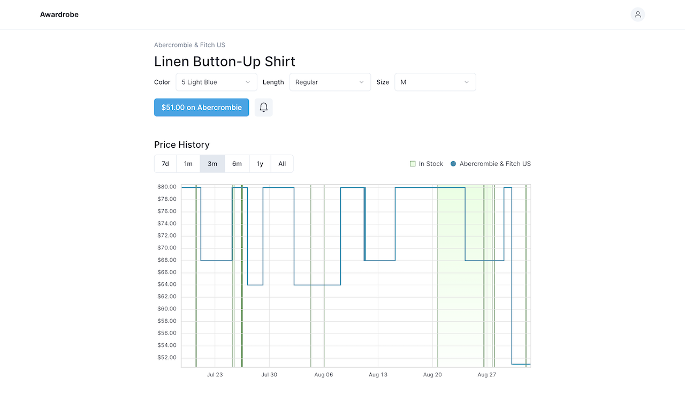

# Awardrobe

**Open source clothes price tracker**

**Awardrobe** is an open source monitoring app that helps users keep track of price and stock changes of the clothes they want to buy.

    

## Features

- Supports products on Abercrombie, Uniqlo, and Zara
- Price history of a product after being added
- Create and delete price drop and re-stock notifications

## Getting Started

To get a local instance running, please follow these steps.

### Prerequisites

- Node.js
- npm
- Instances of MySQL and Meilisearch

### Development

1. Clone the repository
1. Run `npm install`
1. Create a `.env` file if it doesn't already exist
1. Run `npm run dev`
